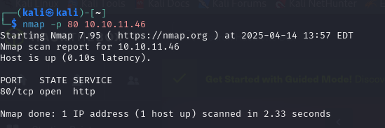

# 📄 Penetration Test Report – Machine 1: Heal

## 🧠 Management Summary

In this penetration test, we targeted the active HackTheBox machine "Heal", which meets the required difficulty level (Medium) and appears to have an HTTP service running on port 80. The objective was to compromise the machine and retrieve the user flag, documenting all identified vulnerabilities and providing remediation recommendations.


## 🌐 Network Setup

The VPN tunnel to HTB was established using OpenVPN on Kali Linux:

```bash
sudo openvpn Desktop/lab_lyfe691.ovpn
```

The connection successfully initialized, assigning the tun interface the IP 10.10.14.234.

```shell
┌──(kali㉿kali)-[~]
└─$ sudo apt update
[sudo] password for kali: 
Get:1 http://mirror.init7.net/kali kali-rolling InRelease [41.5 kB]
Get:2 http://mirror.init7.net/kali kali-rolling/main amd64 Packages [20.9 MB]
Get:3 http://mirror.init7.net/kali kali-rolling/main amd64 Contents (deb) [51.4 MB]
Get:4 http://mirror.init7.net/kali kali-rolling/contrib amd64 Packages [119 kB]
Get:5 http://mirror.init7.net/kali kali-rolling/contrib amd64 Contents (deb) [327 kB]
Get:6 http://mirror.init7.net/kali kali-rolling/non-free amd64 Packages [204 kB]
Get:7 http://mirror.init7.net/kali kali-rolling/non-free amd64 Contents (deb) [914 kB]
Get:8 http://mirror.init7.net/kali kali-rolling/non-free-firmware amd64 Packages [10.6 kB]
Get:9 http://mirror.init7.net/kali kali-rolling/non-free-firmware amd64 Contents (deb) [24.3 kB]
Fetched 74.0 MB in 11s (7,045 kB/s)                                   
963 packages can be upgraded. Run 'apt list --upgradable' to see them.
                                                                       
┌──(kali㉿kali)-[~]
└─$ sudo apt install openvpn -yd
Upgrading:                
  openvpn

Summary:
  Upgrading: 1, Installing: 0, Removing: 0, Not Upgrading: 962
  Download size: 662 kB
  Freed space: 1,024 B

Get:1 http://mirror.init7.net/kali kali-rolling/main amd64 openvpn amd64 2.6.14-1 [662 kB]
Fetched 662 kB in 0s (2,086 kB/s)
Download complete and in download only mode
                                                                       
┌──(kali㉿kali)-[~]
└─$ openvpn --version
OpenVPN 2.6.13 x86_64-pc-linux-gnu [SSL (OpenSSL)] [LZO] [LZ4] [EPOLL] [PKCS11] [MH/PKTINFO] [AEAD] [DCO]
library versions: OpenSSL 3.4.0 22 Oct 2024, LZO 2.10
DCO version: N/A
Originally developed by James Yonan
Copyright (C) 2002-2024 OpenVPN Inc <sales@openvpn.net>
Compile time defines: enable_async_push=no enable_comp_stub=no enable_crypto_ofb_cfb=yes enable_dco=yes enable_dco_arg=yes enable_debug=yes enable_dependency_tracking=no enable_dlopen=unknown enable_dlopen_self=unknown enable_dlopen_self_static=unknown enable_fast_install=needless enable_fragment=yes enable_iproute2=no enable_libtool_lock=yes enable_lz4=yes enable_lzo=yes enable_maintainer_mode=no enable_management=yes enable_option_checking=no enable_pam_dlopen=no enable_pedantic=no enable_pkcs11=yes enable_plugin_auth_pam=yes enable_plugin_down_root=yes enable_plugins=yes enable_port_share=yes enable_selinux=no enable_shared=yes enable_shared_with_static_runtimes=no enable_silent_rules=no enable_small=no enable_static=yes enable_strict=no enable_strict_options=no enable_systemd=yes enable_unit_tests=no enable_werror=no enable_win32_dll=yes enable_wolfssl_options_h=yes enable_x509_alt_username=yes with_aix_soname=aix with_crypto_library=openssl with_gnu_ld=yes with_mem_check=no with_openssl_engine=auto with_sysroot=no
                                                                       
┌──(kali㉿kali)-[~]
└─$ ls                       
Desktop  Documents  Downloads  Music  Pictures  Public  Templates  Videos
                                                                       
┌──(kali㉿kali)-[~]
└─$ openvpn --version
OpenVPN 2.6.13 x86_64-pc-linux-gnu [SSL (OpenSSL)] [LZO] [LZ4] [EPOLL] [PKCS11] [MH/PKTINFO] [AEAD] [DCO]
library versions: OpenSSL 3.4.0 22 Oct 2024, LZO 2.10
DCO version: N/A
Originally developed by James Yonan
Copyright (C) 2002-2024 OpenVPN Inc <sales@openvpn.net>
Compile time defines: enable_async_push=no enable_comp_stub=no enable_crypto_ofb_cfb=yes enable_dco=yes enable_dco_arg=yes enable_debug=yes enable_dependency_tracking=no enable_dlopen=unknown enable_dlopen_self=unknown enable_dlopen_self_static=unknown enable_fast_install=needless enable_fragment=yes enable_iproute2=no enable_libtool_lock=yes enable_lz4=yes enable_lzo=yes enable_maintainer_mode=no enable_management=yes enable_option_checking=no enable_pam_dlopen=no enable_pedantic=no enable_pkcs11=yes enable_plugin_auth_pam=yes enable_plugin_down_root=yes enable_plugins=yes enable_port_share=yes enable_selinux=no enable_shared=yes enable_shared_with_static_runtimes=no enable_silent_rules=no enable_small=no enable_static=yes enable_strict=no enable_strict_options=no enable_systemd=yes enable_unit_tests=no enable_werror=no enable_win32_dll=yes enable_wolfssl_options_h=yes enable_x509_alt_username=yes with_aix_soname=aix with_crypto_library=openssl with_gnu_ld=yes with_mem_check=no with_openssl_engine=auto with_sysroot=no
                                                                       
┌──(kali㉿kali)-[~]
└─$ openvpn Desktop/lab_lyfe691.ovpn 
2025-04-14 13:43:12 WARNING: Compression for receiving enabled. Compression has been used in the past to break encryption. Sent packets are not compressed unless "allow-compression yes" is also set.
2025-04-14 13:43:12 Note: --data-ciphers-fallback with cipher 'AES-128-CBC' disables data channel offload.
2025-04-14 13:43:12 OpenVPN 2.6.13 x86_64-pc-linux-gnu [SSL (OpenSSL)] [LZO] [LZ4] [EPOLL] [PKCS11] [MH/PKTINFO] [AEAD] [DCO]
2025-04-14 13:43:12 library versions: OpenSSL 3.4.0 22 Oct 2024, LZO 2.10
2025-04-14 13:43:12 DCO version: N/A
2025-04-14 13:43:12 TCP/UDP: Preserving recently used remote address: [AF_INET]38.46.226.72:1337
2025-04-14 13:43:12 Socket Buffers: R=[212992->212992] S=[212992->212992]
2025-04-14 13:43:12 UDPv4 link local: (not bound)
2025-04-14 13:43:12 UDPv4 link remote: [AF_INET]38.46.226.72:1337
2025-04-14 13:43:12 TLS: Initial packet from [AF_INET]38.46.226.72:1337, sid=d118f3ff 09ea4848
2025-04-14 13:43:13 VERIFY OK: depth=2, C=GR, O=Hack The Box, OU=Systems, CN=HTB VPN: Root Certificate Authority
2025-04-14 13:43:13 VERIFY OK: depth=1, C=GR, O=Hack The Box, OU=Systems, CN=HTB VPN: us-free-2 Issuing CA
2025-04-14 13:43:13 VERIFY KU OK
2025-04-14 13:43:13 Validating certificate extended key usage
2025-04-14 13:43:13 ++ Certificate has EKU (str) TLS Web Client Authentication, expects TLS Web Server Authentication
2025-04-14 13:43:13 ++ Certificate has EKU (oid) 1.3.6.1.5.5.7.3.2, expects TLS Web Server Authentication
2025-04-14 13:43:13 ++ Certificate has EKU (str) TLS Web Server Authentication, expects TLS Web Server Authentication
2025-04-14 13:43:13 VERIFY EKU OK
2025-04-14 13:43:13 VERIFY OK: depth=0, C=GR, O=Hack The Box, OU=Systems, CN=us-free-2
2025-04-14 13:43:13 Control Channel: TLSv1.3, cipher TLSv1.3 TLS_AES_256_GCM_SHA384, peer certificate: 256 bits ED25519, signature: ED25519, peer temporary key: 253 bits X25519
2025-04-14 13:43:13 [us-free-2] Peer Connection Initiated with [AF_INET]38.46.226.72:1337
2025-04-14 13:43:13 TLS: move_session: dest=TM_ACTIVE src=TM_INITIAL reinit_src=1
2025-04-14 13:43:13 TLS: tls_multi_process: initial untrusted session promoted to trusted
2025-04-14 13:43:14 SENT CONTROL [us-free-2]: 'PUSH_REQUEST' (status=1)
2025-04-14 13:43:14 PUSH: Received control message: 'PUSH_REPLY,route 10.10.10.0 255.255.254.0,route 10.129.0.0 255.255.0.0,route-ipv6 dead:beef::/64,explicit-exit-notify,tun-ipv6,route-gateway 10.10.14.1,topology subnet,ping 10,ping-restart 120,ifconfig-ipv6 dead:beef:2::10e8/64 dead:beef:2::1,ifconfig 10.10.14.234 255.255.254.0,peer-id 57,cipher AES-256-CBC'
2025-04-14 13:43:14 OPTIONS IMPORT: --ifconfig/up options modified
2025-04-14 13:43:14 OPTIONS IMPORT: route options modified
2025-04-14 13:43:14 OPTIONS IMPORT: route-related options modified
2025-04-14 13:43:14 net_route_v4_best_gw query: dst 0.0.0.0
2025-04-14 13:43:14 net_route_v4_best_gw result: via 10.0.2.2 dev eth0
2025-04-14 13:43:14 ROUTE_GATEWAY 10.0.2.2/255.255.255.0 IFACE=eth0 HWADDR=08:00:27:04:42:0f
2025-04-14 13:43:14 GDG6: remote_host_ipv6=n/a
2025-04-14 13:43:14 net_route_v6_best_gw query: dst ::
2025-04-14 13:43:14 net_route_v6_best_gw result: via fe80::2 dev eth0
2025-04-14 13:43:14 ROUTE6_GATEWAY fe80::2 IFACE=eth0
2025-04-14 13:43:14 ERROR: Cannot ioctl TUNSETIFF tun: Operation not permitted (errno=1)
2025-04-14 13:43:14 Exiting due to fatal error
                                                                       
┌──(kali㉿kali)-[~]
└─$ sudo openvpn Desktop/lab_lyfe691.ovpn
2025-04-14 13:43:56 WARNING: Compression for receiving enabled. Compression has been used in the past to break encryption. Sent packets are not compressed unless "allow-compression yes" is also set.
2025-04-14 13:43:56 Note: --data-ciphers-fallback with cipher 'AES-128-CBC' disables data channel offload.
2025-04-14 13:43:56 OpenVPN 2.6.13 x86_64-pc-linux-gnu [SSL (OpenSSL)] [LZO] [LZ4] [EPOLL] [PKCS11] [MH/PKTINFO] [AEAD] [DCO]
2025-04-14 13:43:56 library versions: OpenSSL 3.4.0 22 Oct 2024, LZO 2.10
2025-04-14 13:43:56 DCO version: N/A
2025-04-14 13:43:56 TCP/UDP: Preserving recently used remote address: [AF_INET]38.46.226.72:1337
2025-04-14 13:43:56 Socket Buffers: R=[212992->212992] S=[212992->212992]
2025-04-14 13:43:56 UDPv4 link local: (not bound)
2025-04-14 13:43:56 UDPv4 link remote: [AF_INET]38.46.226.72:1337
2025-04-14 13:43:56 TLS: Initial packet from [AF_INET]38.46.226.72:1337, sid=151c165a 358f2d2e
2025-04-14 13:43:56 VERIFY OK: depth=2, C=GR, O=Hack The Box, OU=Systems, CN=HTB VPN: Root Certificate Authority
2025-04-14 13:43:56 VERIFY OK: depth=1, C=GR, O=Hack The Box, OU=Systems, CN=HTB VPN: us-free-2 Issuing CA
2025-04-14 13:43:56 VERIFY KU OK
2025-04-14 13:43:56 Validating certificate extended key usage
2025-04-14 13:43:56 ++ Certificate has EKU (str) TLS Web Client Authentication, expects TLS Web Server Authentication
2025-04-14 13:43:56 ++ Certificate has EKU (oid) 1.3.6.1.5.5.7.3.2, expects TLS Web Server Authentication
2025-04-14 13:43:56 ++ Certificate has EKU (str) TLS Web Server Authentication, expects TLS Web Server Authentication
2025-04-14 13:43:56 VERIFY EKU OK
2025-04-14 13:43:56 VERIFY OK: depth=0, C=GR, O=Hack The Box, OU=Systems, CN=us-free-2
2025-04-14 13:43:57 Control Channel: TLSv1.3, cipher TLSv1.3 TLS_AES_256_GCM_SHA384, peer certificate: 256 bits ED25519, signature: ED25519, peer temporary key: 253 bits X25519
2025-04-14 13:43:57 [us-free-2] Peer Connection Initiated with [AF_INET]38.46.226.72:1337
2025-04-14 13:43:57 TLS: move_session: dest=TM_ACTIVE src=TM_INITIAL reinit_src=1
2025-04-14 13:43:57 TLS: tls_multi_process: initial untrusted session promoted to trusted
2025-04-14 13:43:58 SENT CONTROL [us-free-2]: 'PUSH_REQUEST' (status=1)
2025-04-14 13:43:59 PUSH: Received control message: 'PUSH_REPLY,route 10.10.10.0 255.255.254.0,route 10.129.0.0 255.255.0.0,route-ipv6 dead:beef::/64,explicit-exit-notify,tun-ipv6,route-gateway 10.10.14.1,topology subnet,ping 10,ping-restart 120,ifconfig-ipv6 dead:beef:2::10e8/64 dead:beef:2::1,ifconfig 10.10.14.234 255.255.254.0,peer-id 58,cipher AES-256-CBC'
2025-04-14 13:43:59 OPTIONS IMPORT: --ifconfig/up options modified
2025-04-14 13:43:59 OPTIONS IMPORT: route options modified
2025-04-14 13:43:59 OPTIONS IMPORT: route-related options modified
2025-04-14 13:43:59 net_route_v4_best_gw query: dst 0.0.0.0
2025-04-14 13:43:59 net_route_v4_best_gw result: via 10.0.2.2 dev eth0
2025-04-14 13:43:59 ROUTE_GATEWAY 10.0.2.2/255.255.255.0 IFACE=eth0 HWADDR=08:00:27:04:42:0f
2025-04-14 13:43:59 GDG6: remote_host_ipv6=n/a
2025-04-14 13:43:59 net_route_v6_best_gw query: dst ::
2025-04-14 13:43:59 net_route_v6_best_gw result: via fe80::2 dev eth0
2025-04-14 13:43:59 ROUTE6_GATEWAY fe80::2 IFACE=eth0
2025-04-14 13:43:59 TUN/TAP device tun0 opened
2025-04-14 13:43:59 net_iface_mtu_set: mtu 1500 for tun0
2025-04-14 13:43:59 net_iface_up: set tun0 up
2025-04-14 13:43:59 net_addr_v4_add: 10.10.14.234/23 dev tun0
2025-04-14 13:43:59 net_iface_mtu_set: mtu 1500 for tun0
2025-04-14 13:43:59 net_iface_up: set tun0 up
2025-04-14 13:43:59 net_addr_v6_add: dead:beef:2::10e8/64 dev tun0
2025-04-14 13:43:59 net_route_v4_add: 10.10.10.0/23 via 10.10.14.1 dev [NULL] table 0 metric -1
2025-04-14 13:43:59 net_route_v4_add: 10.129.0.0/16 via 10.10.14.1 dev [NULL] table 0 metric -1
2025-04-14 13:43:59 add_route_ipv6(dead:beef::/64 -> dead:beef:2::1 metric -1) dev tun0
2025-04-14 13:43:59 net_route_v6_add: dead:beef::/64 via :: dev tun0 table 0 metric -1
2025-04-14 13:43:59 Initialization Sequence Completed
2025-04-14 13:43:59 Data Channel: cipher 'AES-256-CBC', auth 'SHA256', peer-id: 58, compression: 'lzo'
2025-04-14 13:43:59 Timers: ping 10, ping-restart 120
2025-04-14 13:43:59 Protocol options: explicit-exit-notify 1

```

## 🔍 Target Discovery

Target IP of Heal: 10.10.11.46
Initial port scan was performed to verify HTTP access:

```bash
nmap -p 80 10.10.11.46
```

Result:

```shell
Starting Nmap 7.95 ( https://nmap.org ) at 2025-04-14 13:57 EDT
Nmap scan report for 10.10.11.46
Host is up (0.10s latency).

PORT   STATE SERVICE
80/tcp open  http

Nmap done: 1 IP address (1 host up) scanned in 2.33 seconds
```



## 🔧 DNS Configuration for heal.htb

The server on 10.10.11.46 responded with an HTTP redirect to http://heal.htb:

```shell
┌──(kali㉿kali)-[~]
└─$ curl -I http://10.10.11.46

HTTP/1.1 301 Moved Permanently
Server: nginx/1.18.0 (Ubuntu)
Date: Mon, 14 Apr 2025 18:38:43 GMT
Content-Type: text/html
Content-Length: 178
Connection: keep-alive
Location: http://heal.htb/
```

 To resolve the hostname locally, we edited the /etc/hosts file to point heal.htb to the machine's IP.

Command:

```bash
sudo nano /etc/hosts
```

Added line:

```bash
10.10.11.46    heal.htb
```

This allowed us to access the web interface through the correct virtual host.


## 🌐 Initial Web Recon – heal.htb

We confirmed the website was using a React-based frontend by checking the HTML source:

```bash
curl http://heal.htb
```

The response included this section:

```html
<!DOCTYPE html>
<html lang="en">
  <head>
  
    <meta name="viewport" content="width=device-width, initial-scale=1" />
    <meta name="theme-color" content="#000000" />
    <meta
      name="description"
      content="Web site created using create-react-app"
    />
  
    <!--
      manifest.json provides metadata used when your web app is installed on a
      user's mobile device or desktop. See https://developers.google.com/web/fundamentals/web-app-manifest/
    -->
    <link rel="manifest" href="/manifest.json" />
    <!--
      Notice the use of  in the tags above.
      It will be replaced with the URL of the `public` folder during the build.
      Only files inside the `public` folder can be referenced from the HTML.

      Unlike "/favicon.ico" or "favicon.ico", "/favicon.ico" will
      work correctly both with client-side routing and a non-root public URL.
      Learn how to configure a non-root public URL by running `npm run build`.
    -->
    <title>Heal</title>
  </head>
  <body>
    <noscript>You need to enable JavaScript to run this app.</noscript>
    <div id="root"></div>
    <!--
      This HTML file is a template.
      If you open it directly in the browser, you will see an empty page.

      You can add webfonts, meta tags, or analytics to this file.
      The build step will place the bundled scripts into the <body> tag.

      To begin the development, run `npm start` or `yarn start`.
      To create a production bundle, use `npm run build` or `yarn build`.
    -->
  <script src="/static/js/bundle.js"></script><script src="/static/js/0.chunk.js"></script><script src="/static/js/main.chunk.js"></script></body>
</html>

```

pulling it up on firefox, it shows a login page meaning that theres probably a backend:


Knowing that,  i tested the login page and it showed an error so i pulled up the console to see the error better:


The error `Cross-Origin Request Blocked: The Same Origin Policy disallows reading the remote resource at http://api.heal.htb/signin.` indicates that the site is trying to make a request to an API backend.

## 🔁 Subdomain Enumeration – api.heal.htb

As suspected above, the frontend web application attempts to send credentials to http://api.heal.htb/signin, which triggered a CORS policy error in the browser’s console. This strongly suggests a separate API subdomain, likely serving as the backend of the application.

To interact with this API and continue enumerating, we first added it to our /etc/hosts.

Command:

```bash
sudo nano /etc/hosts
```

Added line:

```bash
10.10.11.46    api.heal.htb
```


once thats added we can interact directly with the API.

## 🧠 Framework Fingerprinting

We accessed the subdomain using curl:

```bash
curl -i http://api.heal.htb/
```

The response clearly indicated that the site is powered by Ruby on Rails version 7.1.4, and rendered the default Rails landing page when i accessed it on firefox.


Response headers:

```shell
x-runtime: 0.024878
x-request-id: <...>
x-content-type-options: nosniff
Server: nginx/1.18.0 (Ubuntu)
```

HTML content includes (shows with terminal):

```shell
──(kali㉿kali)-[~]
└─$ curl -i http://api.heal.htb/           

HTTP/1.1 200 OK
Server: nginx/1.18.0 (Ubuntu)
Date: Mon, 14 Apr 2025 20:44:48 GMT
Content-Type: text/html; charset=utf-8
Content-Length: 12515
Connection: keep-alive
x-frame-options: SAMEORIGIN
x-xss-protection: 0
x-content-type-options: nosniff
x-permitted-cross-domain-policies: none
referrer-policy: strict-origin-when-cross-origin
vary: Accept, Origin
etag: W/"22d8bc38737b0109d55ab08419d31ee3"
cache-control: max-age=0, private, must-revalidate
x-request-id: 99290b27-cbec-44b1-b669-9a5329809050
x-runtime: 0.024878

<!DOCTYPE html>
<html>
<head>
  <title>Ruby on Rails 7.1.4</title>
  <meta charset="utf-8">
  <meta name="viewport" content="width=device-width">
  <link rel="icon" href="data:image/svg+xml;base64," />

  <style type="text/css">
    * {
      box-sizing: border-box;
      margin: 0;
      padding: 0;
    }

    body {
      align-items: center;
      background-color: #F0E7E9;
      background-image: url(data:image/svg+xml;base64,PHN2ZyBoZWlnaHQ9IjEwMjQiIHZpZXdCb3g9IjAgMCAxNDQwIDEwMjQiIHdpZHRoPSIxNDQwIiB4bWxucz0iaHR0cDovL3d3dy53My5vcmcvMjAwMC9zdmciPjxwYXRoIGQ9Im0xNDQwIDUxMC4wMDA2NDh2LTUxMC4wMDA2NDhoLTE0NDB2Mzg0LjAwMDY0OGM0MTcuMzExOTM5IDEzMS4xNDIxNzkgODkxIDE3MS41MTMgMTQ0MCAxMjZ6IiBmaWxsPSIjZmZmIi8+PC9zdmc+);
      background-position: center center;
      background-repeat: no-repeat;
      background-size: cover;
      color: #261B23;
      display: flex;
      flex-direction: column;
      font-family: Sans-Serif;
      font-size: calc(0.9em + 0.5vw);
      font-style: normal;
      font-weight: 400;
      justify-content: center;
      line-height: 1.25;
      min-height: 100vh;
      text-align: center;
    }

    nav {
      font-size: 0;
      height: 20vw;
      line-height: 0;
      max-height: 280px;
      max-width: 280px;
      min-height: 86px;
      min-width: 86px;
      width: 20vw;
    }

    nav a {
      background: #D30001;
      border-radius: 100%;
      display: flex;
      transition: background 0.25s cubic-bezier(0.33, 1, 0.68, 1);
      filter: drop-shadow(0 20px 13px rgb(0 0 0 / 0.03)) drop-shadow(0 8px 5px rgb(0 0 0 / 0.08));
    }

    nav a:hover {
      background: #261B23;
    }

    nav a img {
      height: auto;
      max-width: 100%;
      width: 100%;
      cursor: pointer;
    }

    ul {
      bottom: 0;
      left: 0;
      list-style: none;
      margin: 0 2rem 2rem 2rem;
      position: absolute;
      right: 0;
    }
  </style>
</head>

<body>
  <nav>
    <a href="https://rubyonrails.org" target="_blank">
      
    </a>
  </nav>

  <ul>
    <li><strong>Rails version:</strong> 7.1.4</li>
    <li><strong>Ruby version:</strong> ruby 3.3.5 (2024-09-03 revision ef084cc8f4) [x86_64-linux]</li>
  </ul>
</body>

</html>
                                                                                                                                                                                                                                          
┌──(kali㉿kali)-[~]
└─$ curl -i http://api.heal.htb/signin

HTTP/1.1 404 Not Found
Server: nginx/1.18.0 (Ubuntu)
Date: Mon, 14 Apr 2025 20:44:54 GMT
Content-Type: text/html; charset=UTF-8
Content-Length: 0
Connection: keep-alive
x-request-id: 15e797b8-cea5-44f0-b079-e171c013dde4
x-runtime: 0.002132
vary: Origin
                                                                                         
┌──(kali㉿kali)-[~]
└─$ 
```

## 🔍 Looking at what i have found

Now that the api is allowed to be accessed, i can test what i have found so far, the apps login and registration works.
When i register i see the resume builder web app: 


I started looking around more and found the following pages:

profile page:


survey page: 


