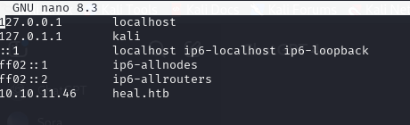

# Machine 1: Heal

## Management Summary

In this penetration test, we targeted the active HackTheBox machine "Heal", which meets the required difficulty level (Medium) and appears to have an HTTP service running on port 80. The objective was to compromise the machine and retrieve the user flag, documenting all identified vulnerabilities and providing remediation recommendations.


## Network Setup

Als erstes habe ich mich mit HTB durch openvpn verbunden: 

```bash
sudo apt update
                                                                       
sudo apt install openvpn -yd

sudo openvpn Desktop/lab_lyfe691.ovpn

```
Das war erfoglreich wie man auf der HTB website sehen kann: 


## Target Discovery

Die target ip ist: 10.10.11.46
Um sicherzustellen, dass ein Dienst auf Port 80 aktiv ist, habe ich einen nmap scan durchgeführt:

```bash
nmap -p 80 10.10.11.46
```

Resultat:

```shell
Starting Nmap 7.95 ( https://nmap.org ) at 2025-04-14 13:57 EDT
Nmap scan report for 10.10.11.46
Host is up (0.10s latency).

PORT   STATE SERVICE
80/tcp open  http

Nmap done: 1 IP address (1 host up) scanned in 2.33 seconds
```

wie man sehen kann, gibt es einen service auf port 80

## DNS Configuration for heal.htb

Da ich verbunden bin habe ich mich entschieden auf http://10.10.11.46 zugehen um den service anzuschauen. Als ich drauf ging hat es mich nach heal.htb redirected, unten der beweis: 

```shell
┌──(kali㉿kali)-[~]
└─$ curl -I http://10.10.11.46

HTTP/1.1 301 Moved Permanently
Server: nginx/1.18.0 (Ubuntu)
Date: Mon, 14 Apr 2025 18:38:43 GMT
Content-Type: text/html
Content-Length: 178
Connection: keep-alive
Location: http://heal.htb/
```
Damit ich die Seite sehen konnte, musste ich den Hostnamen lokal auflösen. Dazu habe ich die Datei /etc/hosts bearbeitet und heal.htb auf die ip addresse der Maschine verwiesen.

```bash
sudo nano /etc/hosts
```

added line:

```bash
10.10.11.46    heal.htb
```



Diese Konfiguration ermöglichte es uns, die Weboberfläche über den korrekten virtuellen Host zu erreichen.

## Initial Web Recon – heal.htb

Dank der konfiguration kann ich jetzt die seite auf firefox sehen.
Wie man sehen kann, wird eine login page angezeigt, was darauf hindeutet, dass ein Backend existiert.


Darum habe ich die Login-Seite getestet, und wie erwartet wurde ein Fehler angezeigt. Daher habe ich die console überprüft, um zu sehen, ob es irgendwo hindeuted.


Der error `Cross-Origin Request Blocked: The Same Origin Policy disallows reading the remote resource at http://api.heal.htb/signin.` zeigt an das die seite versucht eine request zu machen an ein API backend, api.heal.htb

## Subdomain Enumeration – api.heal.htb

Damit ich die API sehen kann, habe ich, wie bereits bei heal.htb, den Eintrag in der Datei /etc/hosts hinzugefügt.

```bash
sudo nano /etc/hosts
```

added line:

```bash
10.10.11.46    api.heal.htb
```


Sobald ich das hinzugefügt habe, können wir direkt mit der API interagieren.

## Framework Fingerprinting

Ich benutze curl um kurz zu sehen was es ergibt

```bash
curl -i http://api.heal.htb/
```
Die Antwort zeigte deutlich, dass die Seite von Ruby on Rails Version 7.1.4 betrieben wird. Beim Zugriff über Firefox wurde die standardmässige rails seite angezeigt.


Response headers:

```shell
x-runtime: 0.024878
x-request-id: <...>
x-content-type-options: nosniff
Server: nginx/1.18.0 (Ubuntu)
```

## 🔍 Looking at what i have found

Da ich jetzt zugriff auf die api habe, kann ich die bisher gefundenen sahcen testen. Das login und reigster der app funktionieren wie erwartet.

Wenn ich mich registriere sehe ich die resume builder web app: 


Ich habe mich ein bisschen mehr erkundet und sah die folgenden seiten: 

profile page:


survey page: 


